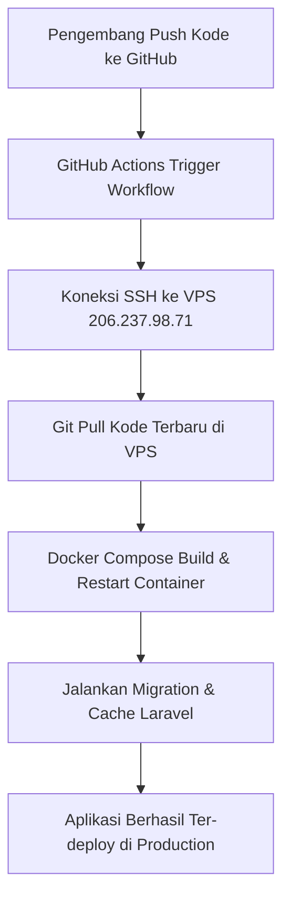

# Implementation Planning: CI/CD Pipeline Laravel Docker to VPS via GitHub Actions

Dokumen ini berisi panduan dan rencana implementasi otomatisasi **CI/CD (Continuous Integration / Continuous Deployment)** untuk aplikasi **Laravel 11 Docker** dari repository **GitHub** ke **VPS (Virtual Private Server)**.

---

## 📌 1. Ringkasan & Arsitektur Alur Kerja



Ketika perubahan kode di-*push* ke cabang `main` atau `master` pada GitHub, **GitHub Actions** akan secara otomatis:
1. Terhubung ke VPS melalui protokol SSH.
2. Membuka direktori aplikasi di VPS.
3. Mengunduh perubahan terbaru dari GitHub (`git pull`).
4. Menjalankan container Docker baru jika ada perubahan konfigurasi (`docker compose up -d --build`).
5. Memerintahkan Laravel untuk menjalankan migrasi database (`php artisan migrate --force`) dan optimasi cache.

---

## 🔑 2. Pengaturan Keamanan (GitHub Repository Secrets)

> [!IMPORTANT]
> **Praktik Keamanan Terbaik:** Jangan pernah menuliskan IP atau Password VPS secara langsung (*hardcode*) dalam file YAML GitHub Action publik/private. Simpan kredensial di **GitHub Secrets**.

### Langkah Setting Secrets di GitHub:
1. Buka repository Anda di GitHub.
2. Masuk ke **Settings** > **Secrets and variables** > **Actions**.
3. Klik tombol **New repository secret** dan tambahkan secret berikut:

| Nama Secret | Nilai / Value | Keterangan |
| :--- | :--- | :--- |
| `VPS_HOST` | `206.237.98.71` | IP Public VPS |
| `VPS_USERNAME` | `root` *(atau username VPS Anda)* | User akses SSH |
| `VPS_PASSWORD` | `DodiPra56` | Password SSH VPS |
| `VPS_PORT` | `22` | Port SSH standar |
| `TARGET_DIR` | `/var/www/lara11_docker` | Lokasi folder proyek di VPS |

---

## 🛠️ 3. Persiapan Awal di Server VPS (One-time Setup)

Sebelum CI/CD dapat berjalan, server VPS harus disiapkan terlebih dahulu.

### Langkah 1: Install Git, Docker, dan Docker Compose di VPS
Masuk ke VPS via SSH di terminal Anda:
```bash
ssh root@206.237.98.71
```
Jalankan perintah berikut di VPS:
```bash
# Update paket sistem
sudo apt update && sudo apt upgrade -y

# Install Git & Docker
sudo apt install -y git docker.io docker-compose-v2

# Pastikan layanan Docker aktif
sudo systemctl enable --now docker
```

### Langkah 2: Clone Repository & Konfigurasi `.env` di VPS
```bash
# Buat direktori aplikasi
mkdir -p /var/www
cd /var/www

# Clone repository dari GitHub
git clone <URL_REPOSITORY_GITHUB_ANDA> lara11_docker
cd lara11_docker

# Copy dan sesuaikan .env produksi
cp .env.example .env
nano .env
```
*Pastikan di file `.env` VPS:*
* `APP_ENV=production`
* `APP_DEBUG=false`
* `APP_URL=http://206.237.98.71`
* `DB_HOST=db`
* `DB_DATABASE=laravel`
* `DB_USERNAME=laravel`
* `DB_PASSWORD=root`

### Langkah 3: Build & Jalankan Container Pertama Kali
```bash
docker compose up -d --build
docker compose exec -T app php artisan key:generate
docker compose exec -T app php artisan migrate --force
```

---

## 🚀 4. Konfigurasi File GitHub Actions (`.github/workflows/deploy.yml`)

Buat file baru di proyek Anda pada jalur: `.github/workflows/deploy.yml` dengan isi berikut:

```yaml
name: Deploy Laravel Docker to VPS

on:
  push:
    branches:
      - main
      - master

jobs:
  deploy:
    name: Deploy Application to VPS
    runs-on: ubuntu-latest

    steps:
      - name: Checkout Code
        uses: actions/checkout@v4

      - name: Deploy via SSH to VPS
        uses: appleboy/ssh-action@v1.0.3
        with:
          host: ${{ secrets.VPS_HOST }}
          username: ${{ secrets.VPS_USERNAME }}
          password: ${{ secrets.VPS_PASSWORD }}
          port: ${{ secrets.VPS_PORT }}
          script: |
            echo "🚀 Navigating to project directory..."
            cd ${{ secrets.TARGET_DIR }} || exit 1

            echo "📥 Pulling latest changes from GitHub..."
            git pull origin main

            echo "🐳 Building and starting Docker containers..."
            docker compose up -d --build

            echo "⚡ Running Laravel optimizations & migrations..."
            docker compose exec -T app php artisan migrate --force
            docker compose exec -T app php artisan config:cache
            docker compose exec -T app php artisan route:cache
            docker compose exec -T app php artisan view:cache

            echo "🧹 Cleaning up unused Docker images..."
            docker image prune -f

            echo "✅ Deployment completed successfully!"
```

---

## 🧪 5. Verifikasi & Pengujian CI/CD

1. Commit dan Push file `.github/workflows/deploy.yml` dan `docker_ciCD.md` ke GitHub:
   ```bash
   git add .github/workflows/deploy.yml docker_ciCD.md
   git commit -m "ci: add GitHub Actions deployment workflow"
   git push origin main
   ```
2. Buka tab **Actions** di repository GitHub Anda untuk melihat status eksekusi *Deployment Workflow*.
3. Setelah tanda centang hijau (`Success`), buka alamat IP VPS di browser:
   👉 **`http://206.237.98.71:8080`**

---

## 🛡️ 6. Strategi Pemulihan (Rollback Plan)

Jika terjadi kendala saat deployment di VPS:
1. SSH ke VPS: `ssh root@206.237.98.71`
2. Masuk ke direktori: `cd /var/www/lara11_docker`
3. Kembalikan commit ke versi sebelumnya:
   ```bash
   git reset --hard HEAD~1
   docker compose up -d --build
   ```
